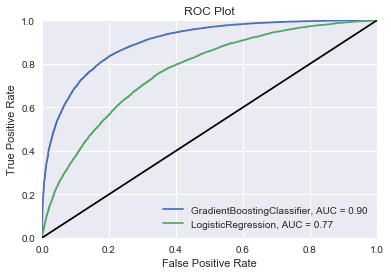
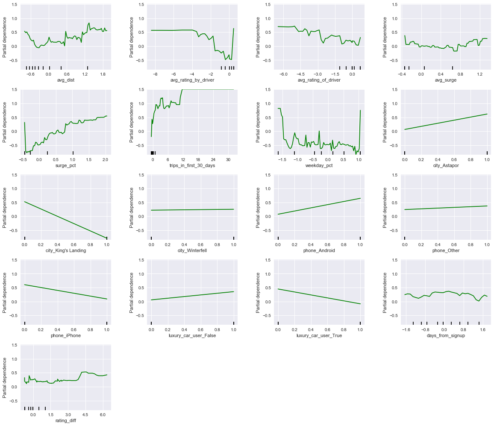

# Churn Analysis - San Francisco Ride Sharing Company

# Table of Contents

1. [Motivation](#motivation)
2. [Data](#data)
3. [Data Cleaning](#data-cleaning)
4. [Exploratory Data Analysis](#exploratory-data-analysis)
5. [Modeling](#modeling)
6. [Results](#results)
7. [Conclusions](#conclusions)

## Motivation

A ride-sharing company (Company X) is interested in predicting rider retention.
To help explore this question, we analyzed a sample dataset of a cohort of
users who signed up for an account in January 2014. The data was pulled on July
1, 2014; we consider a user retained if they were “active” (i.e. took a trip)
in the preceding 30 days (from the day the data was pulled). In other words, a
user is "active" if they have taken a trip since June 1, 2014.

The goal is to help understand **what factors are
the best predictors for retention**, and offer suggestions to operationalize
those insights to help Company X. 

**Note:** Due to the sensitive nature of the data in question, the company name and data will not be included in this analysis.

# Data 

Here is a detailed description of the data:

- `city`: city this user signed up in phone: primary device for this user
- `signup_date`: date of account registration; in the form `YYYYMMDD`
- `last_trip_date`: the last time this user completed a trip; in the form `YYYYMMDD`
- `avg_dist`: the average distance (in miles) per trip taken in the first 30 days after signup
- `avg_rating_by_driver`: the rider’s average rating over all of their trips 
- `avg_rating_of_driver`: the rider’s average rating of their drivers over all of their trips 
- `surge_pct`: the percent of trips taken with surge multiplier > 1 
- `avg_surge`: The average surge multiplier over all of this user’s trips 
- `trips_in_first_30_days`: the number of trips this user took in the first 30 days after signing up 
- `luxury_car_user`: TRUE if the user took a luxury car in their first 30 days; FALSE otherwise 
- `weekday_pct`: the percent of the user’s trips occurring during a weekday

## Data Cleaning

As mentioned above, our target variable 'churn' was created based upon the 'last_trip_date' feature; if the last trip was beyond one month ago, the user was consider to have churned. To avoid data leakage, the 'last_trip_date' feature was subsequently dropped. Beyond standard cleaning processes such as converting categorical variables to dummy variables and standarization, two new features were created; rating_diff and days_from_signup. 'rating_diff' accounted for the absolute difference between driver and user rating for a particular ride, with days_from_signup being self-explanatory.

## Exploratory Data Analysis 

The correlation matrix below investigates the correlation between variables. If strong correlations are found, our model could be negatively impacted if included in our feature space. Beyond relationships we would expect, such as rides in a certain city negatively correlating with a different city, or rating_diff correlating with both rating variables, little stood out in this plot in our feature space. This justifies our decision to include all features in our model. Churn displays some correlations with certain variables. This is our first glimpse into what variables may be predictive of churn.

The violin plot below demonstrates the variability of data in the feature space. Variables ‘avg_dist’, both ‘avg_ratings’, ‘avg_surge’, ’trips_in_first_30_days’, and ‘rating_diff’ displayed exceptionally high variability, spanning more than three standard deviations. Let’s keep an eye on these when interpreting our model results. Perhaps these large deviations can assist in predicting churn. 

 

## Modeling 

A variety of models were attempted to explain our model. Below illustrates the results of our investigation. 

  
| Models + Metrics                      | Scores|
| --------------------------------------|:-----:|  
| LogisticRegression Accuracy:          | 0.736 |
| LogisticRegression Precision:         | 0.736 |   
| LogisticRegression Recall:            | 0.847 | 
| LogisticRegression F1:                | 0.787 |  
| AdaBoostClassifier Accuracy:          | 0.804 |
| AdaBoostClassifier Precision:         | 0.804 |
| AdaBoostClassifier Recall:            | 0.862 |   
| AdaBoostClassifier F1:                | 0.832 |  
| GradientBoostingClassifier Accuracy:  | 0.807 |
| GradientBoostingClassifier Precision: | 0.807 |
| GradientBoostingClassifier Recall:    | 0.862 |
| GradientBoostingClassifier F1:        | 0.834 | 
| RandomForestClassifier Accuracy:      | 0.807 |
| RandomForestClassifier Precision:     | 0.807 |
| RandomForestClassifier Recall:        | 0.808 |
| RandomForestClassifier F1:            | 0.807 | 

It is clear from the table above sk-learn's GradientBoostingClassifier was the most effective classifier across all model metrics. All models did a fairly sufficient job classifying our data, however. An emphasis was placed on recall scores to reduce false negatives. The rationale followed that it was more important for our model to detect potential churners than to avoid misclassifying users as churners.
 
## Results

Once selected, hyperparameters were then optimized for our GradientBoostingClassifier using GridSearch, producing the results below. Little improvement was accrued through this process.

| Metrics                                 | Scores|
| ----------------------------------------|:-----:|
| GradientBoostingClassifier Accuracy:    | 0.807 |
| GradientBoostingClassifier Precision:   | 0.807 |
| GradientBoostingClassifier Recall:      | 0.869 |
| GradientBoostingClassifier F1:          | 0.837 |

Our ROC plot below demonstrates the effectiveness of our tuned model in comparison to a standard classifier, LogisticRegression.

The graph below displays the most important features in creating our model. It seems 'avg_dist', 'weekday_pct', 'trips_in_first_30_days', and 'surge_pct' were particularly important in predicting churn. Let's look at a partial dependency plot to further understand each variables contribution to predicting churn.

From analysis of partial dependencies below, it becomes clearer how our more salient features interact with churn. It seems that extremes of distance are more correlated with churn, whether very short or very long. Perhaps these users are using the app for a very specific purpose, and is not conducive to continued use. Also, it is assumed users are charged a flat rate below certain distances that may irritate users. Extremes of weekday/weekend use seem correlated with higher churn rates. Incentive structures may be beneficial to retain these users and incentivize additional weekend/weekday usage. The correlation between higher use in the first 30 days and churn is an interesting observation. Perhaps when signup promotionals expire some users are less inclined to use the app. Finally, it's not surprising to see high surge percentages correlated with churn. If a large percentage of the time a user is charged extra to use the app, they are less inclined to continue to use it.

## Conclusions

Based on the insights above, a few recommendations can be made to improve customer retention and increase usage.

- Provide discounts for users who routinely travel short or long distances. Perhaps users can buy several rides of a particular distance at a discounted bulk rate.

- A similar incentive structure can be utilized with users with high surge usage.

- Investigation into signup promotions may provide additional insight into explain our discovery regarding trips in the first 30 days. 

- Finally, incentivizing weekday users to use the app on weekends and vise versa may reduce churn. 

A/B testing would be a useful tool in determining the impact of many of the potential changes to business dynamics mentioned above. 

   
 

  
  
